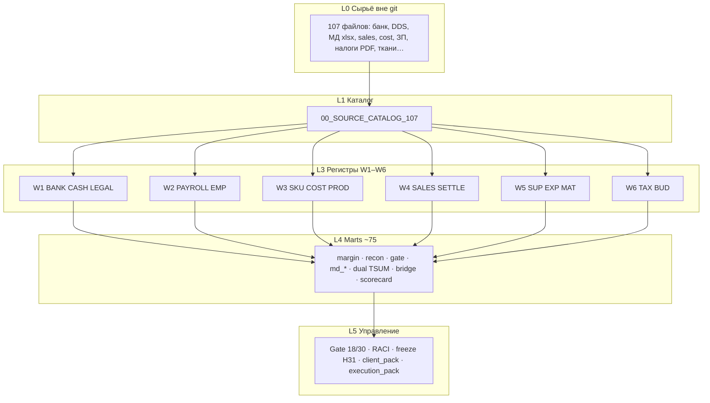
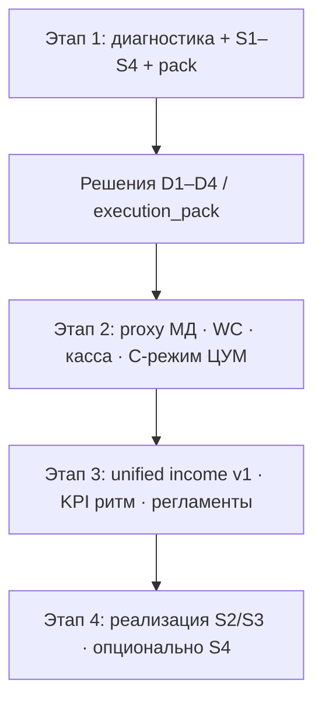
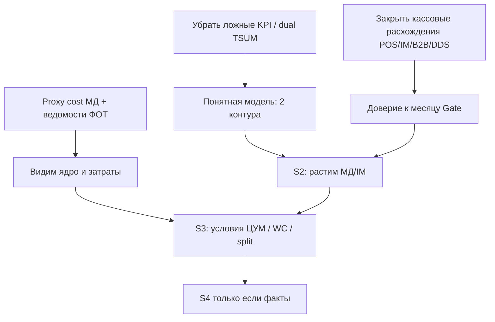

# 18 — Мастер-схема: данные → связи → результат заказчику → сценарии

Updated: 2026-07-27  
Статус: навигационный документ Этапа 1 · не SoT  
Canvas (интерактивно рядом с чатом): см. `yanina-master-scheme.canvas.tsx` в Cursor canvases  
Детали сценариев: `../OPTIMIZATION_SCENARIOS.md` · исполнение: `../maps/execution_pack/`

---

## 1. Что у нас есть из данных (карта активов)



| Актив | Масштаб | Роль |
|-------|---------|------|
| Банк | 4933 платежа | Касса всех LE |
| МД payments / DDS | 2025 ≈ 232.6M ₽@100 | Ядро дохода (~84%) |
| Sales lines | 2826 | Маржа IM/B2B/TSUM |
| Dual TSUM | 37.9% vs 87.9% | Комиссия ≠ product COGS |
| Ткани | ~28.6M end | WC |
| B2B open | 2.51M / 15 док | Утечка CF |
| OTHER_IN | 152.6M в т.ч. POS 62.3M | Долг классификации |
| Gate | 18 RELEASED / 12 BLOCKED | Качество месяца |

---

## 2. Как связаны (ключ → контроль)

```mermaid
flowchart LR
  Bank["Банк IN/OUT"] -->|date amount INN| DDS["ДДС / CASH"]
  Bank -->|ACQ / POS cand| IM["IM recon"]
  Bank -->|агент| TSUM["TSUM net / dual"]
  Bank -->|settle| B2B["B2B open/links"]
  MD["МД payments"] -->|EUR@100| DDS
  Sales["Sales lines"] -->|sku| Cost["COST W3"]
  Cost --> Margin["margin_*"]
  Sales --> Margin
  DDS --> Gate["Release Gate"]
  IM --> Gate
  TSUM --> Gate
  Pay["PAYROLL/OPEX"] --> Multi["multi 100%"]
  Tax["TAX"] -->|УФК| Bank
  Mat["MAT ткани"] --> WC["WC ~28.6M"]
  Gate --> Pack["client_pack / решения"]
```

**Анти-связи (запреты):**
- не джойнить МД services в goods COGS;
- не читать goods operating −58/−74% как P&L компании;
- не резать ЦУМ по reported 38% без product view;
- не сливать POS 62M слепо в ACQ_IM (чинит только ~1/6 OPEN).

---

## 3. Что входит в результат для заказчика (список)

| # | Документ | Содержание для заказчика |
|---|----------|--------------------------|
| 01 | Диагностический отчёт | Системная картина блоков 1–6 ТЗ |
| 02 | Карта ограничений | Что блокирует решения |
| 03 | Карта резервов | Где потенциал (с оговорками) |
| 04 | Матрица приоритетов | Очередь инициатив |
| 05 | Рекомендации / этапы 2–4 | Что после диагностики |
| 06 | Скелет финмодели | Dual-contour черновик |
| 07 | KPI draft | Не система внедрения |
| 08 | Политики P-A… | Черновики правил чтения |
| 09 | Lineage one-pager | Откуда цифры |
| 10 | Реестр рисков | |
| 11–16 | Детали + layers | Цифры, причинность, scorecard |
| 17 | Execution pack | 7 решений + CSV |
| S1–S4 | Сценарии | ₽ и go/no-go |

**Граница:** Этап 1 = диагностика и выбор направления.  
Внедрение модели/KPI/дашбордов/регламентов = Этапы 2–4.



---

## 4. Сценарии оптимизации и бизнес-процессов

Не только сокращение расходов: **дисциплина → рост ядра → условия → структура**.

| | Фокус | Не только cut | ₽ ориентир | Процессы |
|--|-------|---------------|------------|----------|
| **S1** | Дисциплина | Dual, gate, collect, запрет ложных KPI | **1–2.5M разово** + риск↓ | P04 settle, P02/P11 касса, P12 отчётность |
| **S2** | Рост | МД +5–10%, IM умеренно, ЦУМ не режем | **5–12M/год** | P01 цикл заказа/оплаты, P02 IM |
| **S3** | Условия+видимость | ЦУМ −3…5pp, аренда, split ФОТ, прайс B2B, фурнитура | **10–16M/год** | P03 переговоры, P08/P09 split, P05/P06 WC |
| **S4** | Структура | Только после фактов; иначе стресс | **15–25 / стресс 5–10** | LE/каналы/ФОТ — go/no-go |

### Как модель становится прибыльной и понятной



| Расхождение | Что ставим | Зачем для «зарабатывать больше» |
|-------------|------------|----------------------------------|
| Bridge = P&L фирмы | Политика двух контуров | Не режем МД «за товарный минус» |
| TSUM 38% | Dual + договорной % | Не теряем канал с product ~88% |
| POS/invoice в OTHER_IN | ACQ_POS + сверка МД | Чище CF и решения |
| IM OPEN | Реестры | Можно масштабировать IM |
| B2B 2.51M | Collect | Прямые деньги |
| МД без cost | Пилот proxy → учёт | Управляем 84% дохода |
| ФОТ +93% без lines | Ведомости + split | Режем/растить осознанно |
| Ткани без ABC | ABC | Освобождаем капитал в оборот |

**Итог:** прибыльность = ясная модель + рост ядра (S2) + честные условия каналов (S3), а не один cut opex. S1 обязателен как фундамент.

---

## 5. Ближайшие шаги (из execution_pack)

1. `D-ACQ-POS-01` — класс POS (только ИП)  
2. `D-B2B-01` — collect 2.51M  
3. `D-IM-REG-01` — реестры IM  
4. `D-MD-INV-01` — invoice↔МД  
5. ЗП lines / cost МД / %% ЦУМ  

Без этих решений «ещё анализ» не увеличивает истину.
